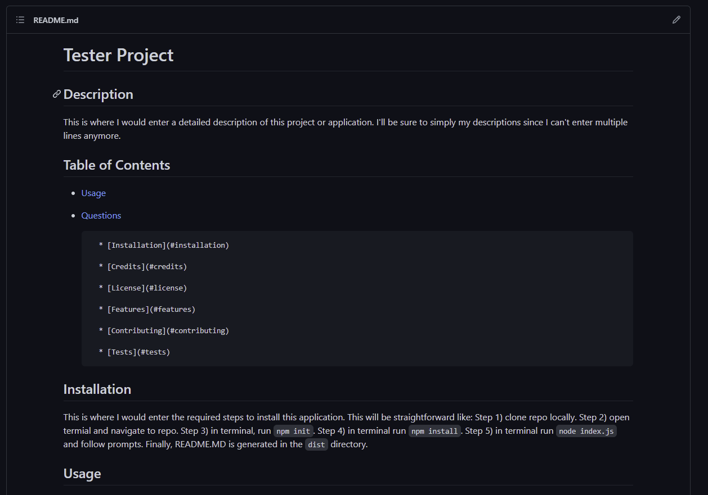

# README Generator
## Description
Quickly generate responsive and detailed README.md files for different projects/applications  with this terminal based application. 

## Table of Contents
* [Usage](#usage)
* [Questions](#questions)

      
* [Installation](#installation)
        
* [Credits](#credits)
        
* [License](#license)
        
* [Features](#features)
        
* [Contributing](#contributing)
        
* [Tests](#tests)
        
    
  

## Installation
This is a `NODE` application: you must must a terminal interface and have node installed to be able to run this application. <br><br> Follow these steps to install this application: <br><br> 1. Clone the repository to your local machine. <br> 2. In the terminal and repository main directory, run `npm install` (this will install the required dependencies). <br><br> You now have everything required to run this application. See Uses on how to use this application.
    
## Usage
This is a `NODE` application: you must have a terminal interface and have node installed to be able to run this application. <br><br> Once you have installed this application (see installation instructions), follow these steps to use this application: <br><br> 1. In the terminal and repository main directory, run `node index.js`. <br> 2. Folow the prompts to create the content of your README.MD: <br>    - The *Title*, *Description*, *Usage*, and *Questions* sections are required. <br>    - You will be prompted to select to add the following sections: *Installation*, *Credits*, *License*, *Contributing*, and *Tests*. If you select to add these, you will be required to add content to these sections. <br>    - See the **Features** section of this README to see some markdown syntax to make your REAME polished. <br> 3. Once you have answered all the prompts, the console should read: <br> ````README file generated!```` <br> The file is added to the `dist` directory. <br><br> **This application was used to generate the README you are currently reading!**

### Screenshot

    

### Link
A WALKTHROUGH VIDEO WILL BE ADDED HERE
    

## Credits
Third-Party Assets <br><br> node.js: https://nodejs.org/en/ <br> Inquirer.js: https://www.npmjs.com/package/inquirer <br>Initial Code: https://github.com/coding-boot-camp/potential-enigma <br><br> Resources <br><br> [Mastering Markdown](https://guides.github.com/features/mastering-markdown/) <br> [Code License](https://choosealicense.com/) <br> [Shields IO](https://shields.io/) <br> [Contributor Covenant](https://www.contributor-covenant.org/)
    

## License
[](https://choosealicense.com/licenses/mit/)
    

## Features
You are able to write markdown text to get a clean and polished READEME even from the terminal! <br><br> Use `<br>` to crete a line break. <br><br> Using [Mastering Markdown](https://guides.github.com/features/mastering-markdown/) as a guide, created different outputs: <br><br> 1. Lists <br> 2. *Italic Text* <br> 3. **Bold Text** <br><br> Inline `code lines` <br> and even syntax highlighting <br> ````Write your syntax or code bits here!```` <br><br> Here's a tip for some of the sections: <br><br> - Screenshot: The screenshot link is already being generated, you only need to add the name of the file you're adding such as `screenshot.PNG`. The README.md will look for this file in the `assets/images` directory so be sure to have one. For this example, if you entered `screenshot.PNG`, the README.md link will be `./assets/images/screenshot.PNG`. <br><br> - Link: You need to enter the complete address of the link you are wanting. This could be to a deployed page, or even a video walkthrough!<br>
    

## Contributing
This application is not open to contribution. <br><br> While generating the README.md, if you opt to add the contributing sections you can either create your own guidelines for outside contribution, or the generator will add this link for you: <br><br>[](https://www.contributor-covenant.org/version/2/0/code_of_conduct/code_of_conduct.md)


## Tests
This application doesn't include any test suites. If your application has any test suites, include examples on how to install and run them here.
    
## Questions
For all questions regarding this project, feel free to contact me at:

GitHub: [SirUbu](https://github.com/SirUbu)

Email: thesirubu@gmail.com
